# Diagrama de Componentes - Backstage + OpenWebUI (Demo Simplificado)

## Arquitectura de Componentes Optimizada para Minikube

```mermaid
graph TB
    subgraph "Frontend Layer"
        subgraph "Backstage UI (Unified)"
            BSC[🎭 Backstage Core UI]
            CHAT_PLUGIN[💬 Chat Plugin<br/>Embedded]
            CAT_UI[📚 Catalog UI]
            DOCS_UI[📖 TechDocs UI]
        end
    end
    
    subgraph "Backend Layer"
        subgraph "Backstage Backend Pod (512Mi)"
            BS_CORE[🎭 Backstage Core]
            BS_PROXY[🔄 Built-in Proxy]
            BS_AUTH[🔐 Basic Auth]
            BS_CATALOG[📚 Catalog Service]
            BS_TECHDOCS[📖 TechDocs Service]
        end
        
        subgraph "OpenWebUI Backend Pod (512Mi)"
            OW_API[🔌 OpenWebUI API]
            OW_ENGINE[🤖 Chat Engine]
            OW_MODELS[🧠 Model Manager]
        end
    end
    
    subgraph "Data Layer"
        subgraph "PostgreSQL Pod (256Mi)"
            PG_SHARED[(🗄️ Shared Database)]
            PG_BACKSTAGE[📚 Backstage Schema]
            PG_OPENWEBUI[💬 OpenWebUI Schema]
        end
        
        subgraph "Optional Cache (128Mi)"
            REDIS_CACHE[(⚡ Redis Cache)]
        end
        
        subgraph "File Storage"
            LOCAL_STORAGE[📁 Local Persistent<br/>Volumes]
        end
    end
    
    subgraph "Documentation Layer"
        subgraph "MkDocs Pod (128Mi)"
            MKDOCS_ENGINE[📖 MkDocs Engine]
            DOC_PROCESSOR[📝 Doc Processor]
            STATIC_GEN[🏭 Static Generator]
        end
    end
    
    subgraph "Infrastructure Layer"
        subgraph "Kubernetes Resources"
            K8S_INGRESS[🌐 Ingress Controller]
            K8S_SERVICES[🔧 Services]
            K8S_CONFIGMAPS[⚙️ ConfigMaps]
            K8S_SECRETS[🔒 Secrets]
        end
        
        subgraph "Optional CI/CD (512Mi)"
            JENKINS[🏗️ Jenkins<br/>Basic Pipeline]
        end
    end
    
    subgraph "External Services"
        DH[🐳 DockerHub<br/>edissonz8809/iaops]
        LLM_API[🧠 External LLM<br/>Optional]
    end
    
    %% Frontend Connections
    BSC --> CHAT_PLUGIN
    BSC --> CAT_UI
    BSC --> DOCS_UI
    
    %% Frontend to Backend
    CHAT_PLUGIN --> BS_PROXY
    CAT_UI --> BS_CATALOG
    DOCS_UI --> BS_TECHDOCS
    
    %% Backend Internal Connections
    BS_CORE --> BS_PROXY
    BS_CORE --> BS_AUTH
    BS_CORE --> BS_CATALOG
    BS_CORE --> BS_TECHDOCS
    
    %% Proxy to OpenWebUI
    BS_PROXY --> OW_API
    OW_API --> OW_ENGINE
    OW_API --> OW_MODELS
    
    %% Data Connections
    BS_CATALOG --> PG_BACKSTAGE
    BS_AUTH --> PG_BACKSTAGE
    OW_ENGINE --> PG_OPENWEBUI
    PG_BACKSTAGE --> PG_SHARED
    PG_OPENWEBUI --> PG_SHARED
    
    %% Optional Cache
    OW_ENGINE -.-> REDIS_CACHE
    BS_CORE -.-> REDIS_CACHE
    
    %% Documentation Flow
    OW_ENGINE --> DOC_PROCESSOR
    DOC_PROCESSOR --> MKDOCS_ENGINE
    MKDOCS_ENGINE --> STATIC_GEN
    STATIC_GEN --> BS_TECHDOCS
    
    %% Storage
    PG_SHARED --> LOCAL_STORAGE
    STATIC_GEN --> LOCAL_STORAGE
    
    %% Infrastructure
    BS_CORE --> K8S_SERVICES
    OW_API --> K8S_SERVICES
    K8S_SERVICES --> K8S_INGRESS
    K8S_SERVICES --> K8S_CONFIGMAPS
    K8S_SERVICES --> K8S_SECRETS
    
    %% External
    OW_ENGINE -.-> LLM_API
    JENKINS -.-> DH
    
    classDef frontendClass fill:#e3f2fd
    classDef backendClass fill:#f3e5f5
    classDef dataClass fill:#e8f5e8
    classDef docClass fill:#fff3e0
    classDef infraClass fill:#fce4ec
    classDef optionalClass fill:#f1f8e9,stroke-dasharray: 5 5
    classDef externalClass fill:#fff8e1
    
    class BSC,CHAT_PLUGIN,CAT_UI,DOCS_UI frontendClass
    class BS_CORE,BS_PROXY,BS_AUTH,BS_CATALOG,BS_TECHDOCS,OW_API,OW_ENGINE,OW_MODELS backendClass
    class PG_SHARED,PG_BACKSTAGE,PG_OPENWEBUI,LOCAL_STORAGE dataClass
    class MKDOCS_ENGINE,DOC_PROCESSOR,STATIC_GEN docClass
    class K8S_INGRESS,K8S_SERVICES,K8S_CONFIGMAPS,K8S_SECRETS infraClass
    class REDIS_CACHE,JENKINS optionalClass
    class DH,LLM_API externalClass
```



## Detalle de Componentes Optimizados

### Frontend Layer (Unificado)

#### Backstage UI Integrado
- **Backstage Core UI**: Framework principal con todas las funcionalidades
- **Chat Plugin Embedded**: Plugin de chat integrado directamente en la UI
- **Catalog UI**: Interfaz del catálogo de servicios
- **TechDocs UI**: Interfaz de documentación técnica integrada

### Backend Layer (Simplificado)

#### Backstage Backend Pod (512Mi RAM)
- **Backstage Core**: Servidor principal con todas las funcionalidades
- **Built-in Proxy**: Proxy integrado para comunicación con OpenWebUI
- **Basic Auth**: Autenticación básica sin servicios externos
- **Catalog Service**: Gestión del catálogo integrada
- **TechDocs Service**: Servicio de documentación integrado

#### OpenWebUI Backend Pod (512Mi RAM)
- **OpenWebUI API**: API principal optimizada
- **Chat Engine**: Motor de chat con recursos limitados
- **Model Manager**: Gestión básica de modelos

### Data Layer (Compartido)

#### PostgreSQL Pod (256Mi RAM)
- **Shared Database**: Base de datos única para ambos servicios
- **Backstage Schema**: Esquema específico para Backstage
- **OpenWebUI Schema**: Esquema específico para OpenWebUI

#### Optional Cache (128Mi RAM)
- **Redis Cache**: Cache opcional solo si hay recursos disponibles

#### File Storage
- **Local Persistent Volumes**: Almacenamiento local para archivos

### Documentation Layer (Ligero)

#### MkDocs Pod (128Mi RAM)
- **MkDocs Engine**: Motor de generación de documentación
- **Doc Processor**: Procesador simple de conversaciones
- **Static Generator**: Generador de contenido estático

### Infrastructure Layer (Básico)

#### Kubernetes Resources
- **Ingress Controller**: Controlador de entrada único
- **Services**: Servicios básicos de Kubernetes
- **ConfigMaps**: Configuraciones centralizadas
- **Secrets**: Gestión básica de secretos

#### Optional CI/CD (512Mi RAM)
- **Jenkins**: Pipeline básico solo si hay recursos

### External Services (Mínimos)
- **DockerHub**: Registro de imágenes
- **External LLM**: API externa opcional para modelos avanzados

## Configuración de Recursos Detallada

### Pods Core (Obligatorios)
```yaml
# Backstage Backend
resources:
  requests:
    memory: "256Mi"
    cpu: "200m"
  limits:
    memory: "512Mi"
    cpu: "500m"

# OpenWebUI Backend  
resources:
  requests:
    memory: "256Mi"
    cpu: "200m"
  limits:
    memory: "512Mi"
    cpu: "500m"

# PostgreSQL Shared
resources:
  requests:
    memory: "128Mi"
    cpu: "100m"
  limits:
    memory: "256Mi"
    cpu: "200m"

# MkDocs
resources:
  requests:
    memory: "64Mi"
    cpu: "50m"
  limits:
    memory: "128Mi"
    cpu: "100m"
```

### Pods Opcionales
```yaml
# Redis Cache (si hay recursos)
resources:
  requests:
    memory: "64Mi"
    cpu: "50m"
  limits:
    memory: "128Mi"
    cpu: "100m"

# Jenkins (si hay recursos)
resources:
  requests:
    memory: "256Mi"
    cpu: "200m"
  limits:
    memory: "512Mi"
    cpu: "500m"
```

## Patrones de Comunicación Simplificados

### Comunicación Síncrona
- **Frontend → Backstage Backend**: HTTP directo
- **Backstage Backend → OpenWebUI**: Proxy HTTP interno
- **Servicios → PostgreSQL**: Conexiones directas de base de datos

### Comunicación Asíncrona (Mínima)
- **PostgreSQL → MkDocs**: Webhook simple para generación de docs
- **MkDocs → Backstage**: Notificación de docs actualizadas

### Caching Strategy (Opcional)
- **Redis Cache**: Solo para datos frecuentemente accedidos si hay recursos
- **Local Cache**: Cache en memoria dentro de cada pod

## Ventajas de la Arquitectura Simplificada

### Eficiencia de Recursos
- **Menos pods**: Menor overhead de Kubernetes
- **Servicios integrados**: Menos comunicación inter-pod
- **Base de datos compartida**: Menor uso de memoria y almacenamiento

### Simplicidad Operacional
- **Menos configuración**: Menor complejidad de setup
- **Debugging más fácil**: Menos componentes para troubleshoot
- **Despliegue más rápido**: Menos dependencias entre servicios

### Performance para Demo
- **Latencia reducida**: Comunicación directa entre componentes
- **Startup rápido**: Menos servicios que inicializar
- **Recursos predecibles**: Configuración fija y conocida

## Limitaciones Aceptadas

### Escalabilidad
- **Single instance**: No load balancing automático
- **Recursos fijos**: No auto-scaling
- **Shared database**: Posible cuello de botella

### Disponibilidad
- **Single point of failure**: Si un pod falla, afecta funcionalidad
- **No redundancia**: Sin réplicas para alta disponibilidad
- **Backup manual**: Sin backup automático configurado

### Seguridad
- **Autenticación básica**: No production-ready
- **Comunicación interna**: Sin encriptación adicional
- **Secrets básicos**: Gestión simple de credenciales

## Detalle de Componentes por Capa

### Frontend Components

#### Backstage UI Components
- **Backstage Core**: Framework principal de la interfaz
- **Backstage Plugins**: Sistema de plugins extensible
- **Chat Plugin**: Plugin personalizado para integración con OpenWebUI
- **Catalog UI**: Interfaz del catálogo de servicios
- **Templates UI**: Interfaz para templates de scaffolding
- **Docs UI**: Interfaz de documentación técnica

#### OpenWebUI Components
- **OpenWebUI Core**: Núcleo de la aplicación de chat
- **Chat Interface**: Interfaz de conversación
- **Model Manager**: Gestión de modelos de IA
- **Admin Panel**: Panel de administración

### Backend Components

#### Backstage Backend
- **Backstage Core Backend**: Servidor principal de Backstage
- **Catalog Service**: Gestión del catálogo de servicios
- **Scaffolder Service**: Servicio de generación de templates
- **TechDocs Service**: Servicio de documentación técnica
- **Auth Service**: Servicio de autenticación
- **Proxy Service**: Proxy para servicios externos

#### OpenWebUI Backend
- **OpenWebUI API**: API principal de OpenWebUI
- **Chat Engine**: Motor de procesamiento de chat
- **Models API**: API para gestión de modelos
- **User Manager**: Gestión de usuarios
- **Chat Manager**: Gestión de conversaciones

#### Integration Services
- **API Gateway**: Punto de entrada unificado
- **Message Broker**: Broker de mensajes asíncronos
- **Event Bus**: Bus de eventos para comunicación
- **Webhook Manager**: Gestión de webhooks

### Data Layer

#### Databases
- **PostgreSQL Backstage**: Base de datos principal de Backstage
- **PostgreSQL OpenWebUI**: Base de datos de OpenWebUI
- **Redis Cache**: Cache distribuido
- **Redis Sessions**: Gestión de sesiones

#### File Storage
- **Documentation Storage**: Almacenamiento de documentación
- **Chat History Storage**: Historial de conversaciones
- **Template Storage**: Almacenamiento de templates
- **Asset Storage**: Recursos estáticos

### External Services

#### AI/ML Services
- **LLM API**: API de modelos de lenguaje
- **Embedding API**: API de embeddings
- **Vector Database**: Base de datos vectorial

#### Documentation Services
- **MkDocs Engine**: Motor de generación de documentación
- **Markdown Processor**: Procesador de Markdown
- **Search Engine**: Motor de búsqueda

### Infrastructure Components

#### Kubernetes Resources
- **Ingress Controller**: Controlador de ingreso
- **K8s Services**: Servicios de Kubernetes
- **ConfigMaps**: Mapas de configuración
- **Secrets**: Gestión de secretos
- **Persistent Volumes**: Volúmenes persistentes

#### Monitoring & Observability
- **Prometheus**: Métricas y monitoreo
- **Grafana**: Visualización de métricas
- **Jaeger**: Trazabilidad distribuida
- **Fluentd**: Agregación de logs

## Patrones de Comunicación

### Síncrona
- Frontend ↔ API Gateway ↔ Backend Services
- Backend Services ↔ Databases

### Asíncrona
- Event Bus para eventos de sistema
- Message Broker para procesamiento en background
- Webhooks para integraciones externas

### Caching Strategy
- Redis Cache para datos frecuentemente accedidos
- Redis Sessions para gestión de sesiones de usuario
- Vector Database para búsquedas semánticas optimizadas
