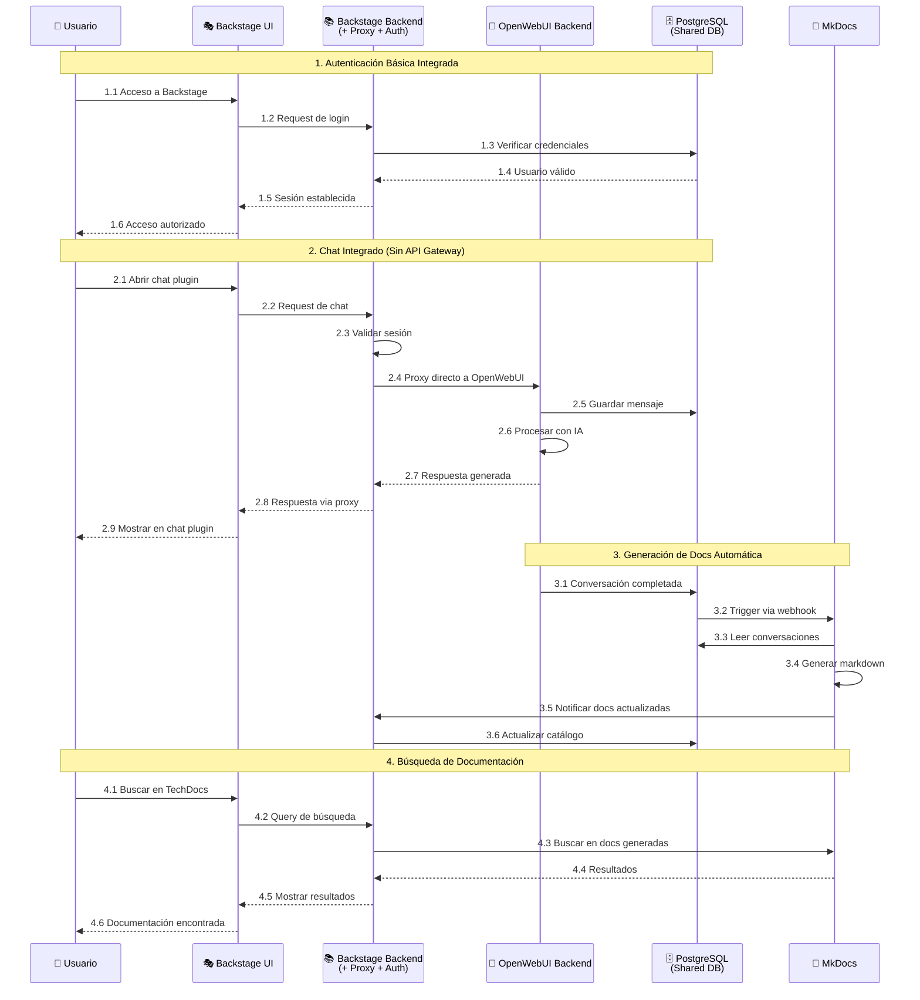
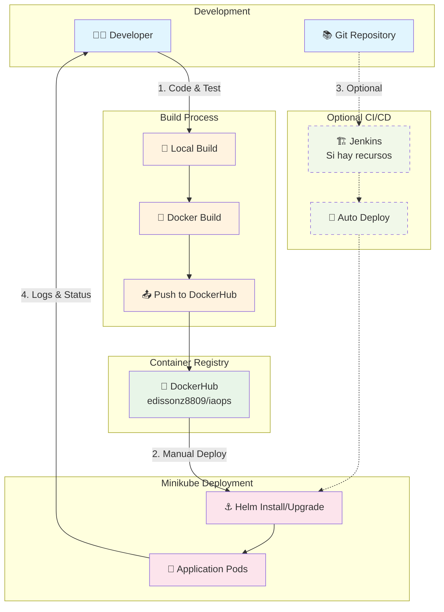
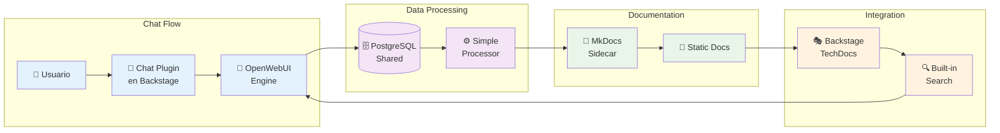

# Diagrama de Flujo de Datos - Backstage + OpenWebUI (Demo Simplificado)

## Flujo de Datos Simplificado



## Flujo de Despliegue Simplificado



## Flujo de Integración Chat-Documentación Optimizado



## Descripción de Flujos Optimizados

### 1. Flujo de Autenticación Básica Integrada
- **Simplificación**: Autenticación manejada directamente por Backstage Backend
- **Sin tokens JWT**: Sesiones simples para demo
- **Base de datos compartida**: Un solo punto de verificación de usuarios

### 2. Flujo de Chat Directo (Sin API Gateway)
- **Proxy integrado**: Backstage Backend actúa como proxy hacia OpenWebUI
- **Comunicación directa**: Menos latencia y overhead
- **Validación de sesión**: Verificación simple antes del proxy

### 3. Flujo de Documentación Automática
- **Webhook simple**: Trigger directo desde base de datos
- **MkDocs como sidecar**: Contenedor auxiliar para generación
- **Integración nativa**: Uso de TechDocs de Backstage

### 4. Flujo de Búsqueda Integrada
- **Búsqueda nativa**: Uso del motor de búsqueda integrado de Backstage
- **Sin servicios externos**: Todo dentro del ecosistema de Backstage

## Ventajas de los Flujos Simplificados

### Performance
- **Menos saltos de red**: Comunicación directa entre componentes
- **Menor latencia**: Sin API Gateway intermedio
- **Cache opcional**: Redis solo si hay recursos disponibles

### Simplicidad
- **Menos configuración**: Menor complejidad de setup
- **Debugging más fácil**: Menos componentes en la cadena
- **Logs centralizados**: Más fácil seguimiento de requests

### Recursos
- **Menor uso de memoria**: Menos servicios ejecutándose
- **Menor uso de CPU**: Menos overhead de comunicación
- **Startup más rápido**: Menos dependencias entre servicios

## Configuración de Recursos por Flujo

### Flujo de Chat (Crítico)
- **Backstage Backend**: 512Mi RAM, 0.5 CPU
- **OpenWebUI Backend**: 512Mi RAM, 0.5 CPU
- **PostgreSQL**: 256Mi RAM, 0.2 CPU

### Flujo de Documentación (Importante)
- **MkDocs Sidecar**: 128Mi RAM, 0.1 CPU
- **Procesamiento**: Compartido con PostgreSQL

### Flujo de Autenticación (Básico)
- **Integrado en Backstage**: Sin recursos adicionales
- **Sesiones**: Almacenadas en PostgreSQL compartida

## Monitoreo Simplificado

### Logs Nativos de Kubernetes
```bash
# Ver logs de Backstage
kubectl logs -f deployment/backstage

# Ver logs de OpenWebUI
kubectl logs -f deployment/openwebui

# Ver logs de PostgreSQL
kubectl logs -f deployment/postgresql
```

### Métricas Básicas
- **Resource usage**: `kubectl top pods`
- **Status**: `kubectl get pods`
- **Events**: `kubectl get events`

## Troubleshooting de Flujos

### Problemas Comunes
1. **Chat no responde**: Verificar conectividad Backstage → OpenWebUI
2. **Docs no se generan**: Verificar webhook de PostgreSQL → MkDocs
3. **Autenticación falla**: Verificar configuración de base de datos
4. **Performance lenta**: Verificar recursos disponibles en Minikube

### Comandos de Diagnóstico
```bash
# Verificar conectividad interna
kubectl exec -it backstage-pod -- curl http://openwebui-service:8080/health

# Verificar base de datos
kubectl exec -it postgresql-pod -- psql -U postgres -c "\l"

# Verificar recursos
kubectl describe node minikube
```
