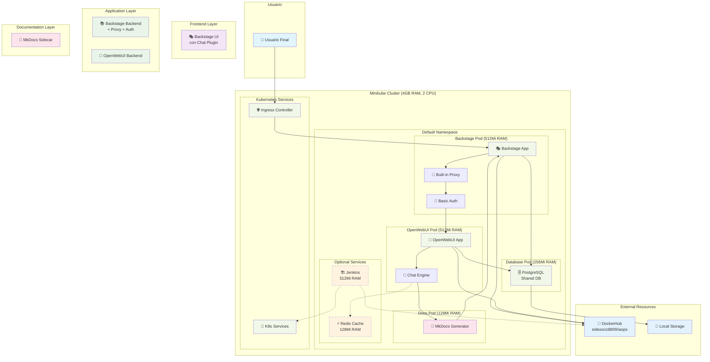

# Diagrama de Arquitectura General - Backstage + OpenWebUI (Demo Minikube)

## Arquitectura Simplificada para Demo



## Recursos Estimados por Componente

### Servicios Core (Obligatorios)
| Componente | RAM | CPU | Descripción |
|------------|-----|-----|-------------|
| Backstage Pod | 512Mi | 0.5 | UI + Backend + Proxy + Auth |
| OpenWebUI Pod | 512Mi | 0.5 | Chat Interface + Engine |
| PostgreSQL Pod | 256Mi | 0.2 | Base de datos compartida |
| MkDocs Pod | 128Mi | 0.1 | Generador de documentación |
| **Total Core** | **1.4GB** | **1.3** | **Funcionalidad mínima** |

### Servicios Opcionales
| Componente | RAM | CPU | Descripción |
|------------|-----|-----|-------------|
| Redis Cache | 128Mi | 0.1 | Cache para mejor performance |
| Jenkins | 512Mi | 0.5 | CI/CD básico |
| **Total Opcional** | **640Mi** | **0.6** | **Funcionalidades extra** |

### Configuración Minikube Recomendada
```bash
# Configuración mínima
minikube start --memory=4096 --cpus=2 --disk-size=20g

# Configuración recomendada (si hay recursos)
minikube start --memory=6144 --cpus=3 --disk-size=30g
```

## Descripción de Componentes Simplificados

### Frontend Layer
- **Backstage UI con Chat Plugin**: Interfaz única que incluye funcionalidad de chat embebida

### Application Layer
- **Backstage Backend**: Incluye proxy integrado y autenticación básica
- **OpenWebUI Backend**: Motor de chat optimizado para recursos limitados

### Documentation Layer
- **MkDocs Sidecar**: Generador de documentación como contenedor auxiliar

### Infrastructure Layer (Minikube)
- **Backstage Pod**: Contiene toda la funcionalidad de Backstage
- **OpenWebUI Pod**: Aplicación de chat independiente
- **PostgreSQL Pod**: Base de datos compartida para ambos servicios
- **MkDocs Pod**: Generador de documentación estática

### Servicios Opcionales
- **Redis Cache**: Solo si hay recursos disponibles para mejorar performance
- **Jenkins**: CI/CD básico, opcional para demo

### External Resources
- **DockerHub**: Registro de imágenes (edissonz8809/iaops)
- **Local Storage**: Almacenamiento persistente local

## Ventajas de la Arquitectura Simplificada

### Eficiencia de Recursos
- **Menos componentes**: Reducción de overhead de memoria y CPU
- **Comunicación directa**: Sin latencia adicional de API Gateway
- **Base de datos compartida**: Menor uso de recursos de almacenamiento

### Simplicidad de Despliegue
- **Menos configuración**: Menor complejidad de setup
- **Menos puntos de falla**: Arquitectura más robusta para demo
- **Setup rápido**: Tiempo de inicialización reducido

### Mantenibilidad
- **Menos servicios**: Más fácil de debuggear y mantener
- **Configuración centralizada**: Menos archivos de configuración
- **Logs simplificados**: Más fácil seguimiento de problemas

## Limitaciones Aceptadas

### Escalabilidad
- Single instance de cada servicio
- No load balancing automático
- Recursos fijos por pod

### Seguridad
- Autenticación básica (no production-ready)
- Sin separación de concerns de seguridad
- Comunicación interna sin encriptación adicional

### Monitoreo
- Logs básicos de Kubernetes
- Sin métricas avanzadas
- Monitoreo manual

## Configuración de Desarrollo vs Producción

### Para Demo/Desarrollo
```yaml
resources:
  requests:
    memory: "128Mi"
    cpu: "100m"
  limits:
    memory: "512Mi"
    cpu: "500m"
```

### Para Producción (Futura)
```yaml
resources:
  requests:
    memory: "512Mi"
    cpu: "250m"
  limits:
    memory: "2Gi"
    cpu: "1000m"
```
