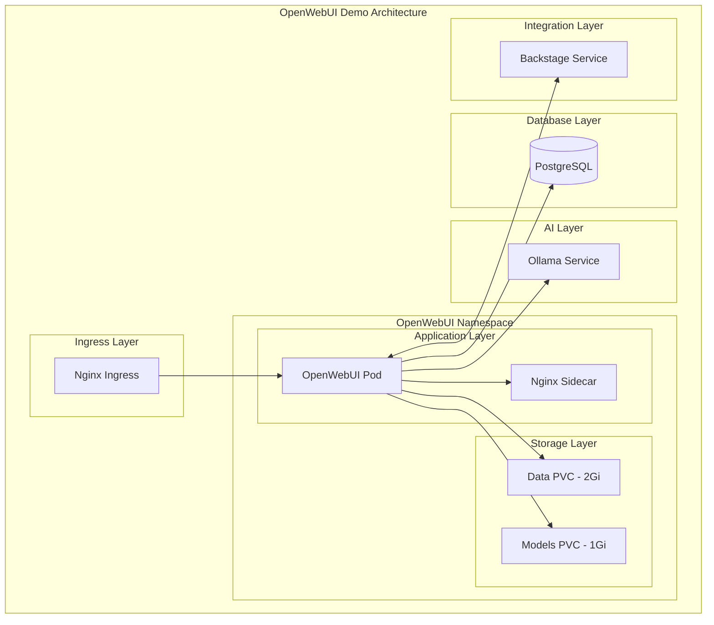

# OpenWebUI Deployment Guide

Guía completa para el despliegue de OpenWebUI optimizado para demo en Minikube con integración Backstage.

## Tabla de Contenidos

- [Descripción General](#descripción-general)
- [Arquitectura](#arquitectura)
- [Prerequisitos](#prerequisitos)
- [Métodos de Despliegue](#métodos-de-despliegue)
- [Configuración por Entorno](#configuración-por-entorno)
- [Integración con Backstage](#integración-con-backstage)
- [Monitoreo y Logs](#monitoreo-y-logs)
- [Troubleshooting](#troubleshooting)
- [Mantenimiento](#mantenimiento)

## Descripción General

OpenWebUI es una interfaz web moderna para interactuar con modelos de lenguaje AI. Esta implementación está optimizada para:

- **Demo en Minikube**: Recursos limitados (512Mi RAM, 500m CPU)
- **Integración Backstage**: Comunicación directa con Backstage
- **Base de datos compartida**: PostgreSQL para persistencia
- **Escalabilidad**: HPA configurado para demo
- **Seguridad**: Network policies y RBAC

### Características Principales

- ✅ **Chat AI**: Interfaz conversacional con modelos LLM
- ✅ **File Upload**: Subida de archivos hasta 10MB
- ✅ **Backstage Integration**: API y webhook integration
- ✅ **Multi-model Support**: Ollama y OpenAI
- ✅ **Persistent Storage**: 2Gi para datos, 1Gi para modelos
- ✅ **Health Checks**: Liveness y readiness probes
- ✅ **Auto-scaling**: HPA con métricas CPU/Memory

## Arquitectura



### Componentes

| Componente | Descripción | Recursos |
|------------|-------------|----------|
| **OpenWebUI** | Aplicación principal | 512Mi RAM, 500m CPU |
| **Nginx Sidecar** | Proxy reverso | 64Mi RAM, 50m CPU |
| **PostgreSQL** | Base de datos | 256Mi RAM, 300m CPU |
| **Data PVC** | Almacenamiento datos | 2Gi |
| **Models PVC** | Almacenamiento modelos | 1Gi |

## Prerequisitos

### Software Requerido

```bash
# Verificar prerequisitos
kubectl version --client
helm version
minikube version
curl --version
```

### Cluster Requirements

- **Minikube**: 4GB RAM, 2 CPU cores
- **Kubernetes**: v1.20+
- **Helm**: v3.8+
- **Storage Class**: `standard` (Minikube default)

### Addons de Minikube

```bash
# Habilitar addons necesarios
minikube addons enable ingress
minikube addons enable metrics-server
minikube addons enable dashboard
```

## Métodos de Despliegue

### 1. Despliegue con Helm (Recomendado)

#### Despliegue Básico

```bash
# Desplegar con configuración demo
./scripts/deploy-openwebui.sh

# Desplegar en entorno específico
./scripts/deploy-openwebui.sh --environment dev
./scripts/deploy-openwebui.sh --environment demo
./scripts/deploy-openwebui.sh --environment prod
```

#### Despliegue Avanzado

```bash
# Dry run para ver cambios
./scripts/deploy-openwebui.sh --dry-run

# Forzar redespliegue
./scripts/deploy-openwebui.sh --force

# Despliegue con namespace personalizado
./scripts/deploy-openwebui.sh --namespace openwebui-custom

# Despliegue con timeout personalizado
./scripts/deploy-openwebui.sh --timeout 900s
```

#### Comandos Helm Directos

```bash
# Instalar con valores por defecto
helm install openwebui ./helm/openwebui \
  --namespace openwebui-demo \
  --create-namespace \
  --wait

# Instalar con valores específicos
helm install openwebui ./helm/openwebui \
  --namespace openwebui-demo \
  --values ./helm/openwebui/values-demo.yaml \
  --wait

# Actualizar despliegue
helm upgrade openwebui ./helm/openwebui \
  --namespace openwebui-demo \
  --values ./helm/openwebui/values-demo.yaml
```

### 2. Despliegue con kubectl

```bash
# Desplegar manifiestos
./scripts/deploy-openwebui.sh --method kubectl

# O manualmente
kubectl apply -f k8s/openwebui/

# Verificar despliegue
kubectl get all -n openwebui-demo
```

## Configuración por Entorno

### Development Environment

```yaml
# values-dev.yaml highlights
replicaCount: 1
resources:
  limits:
    cpu: 1000m
    memory: 1Gi
  requests:
    cpu: 200m
    memory: 512Mi

autoscaling:
  enabled: false

openwebui:
  features:
    codeExecution: true
    webSearch: true
  auth:
    defaultUserRole: "admin"

networkPolicy:
  enabled: false
```

### Demo Environment

```yaml
# values-demo.yaml highlights
replicaCount: 1
resources:
  limits:
    cpu: 500m
    memory: 512Mi
  requests:
    cpu: 100m
    memory: 256Mi

autoscaling:
  enabled: true
  minReplicas: 1
  maxReplicas: 2

demo:
  enabled: true
  minikube:
    optimized: true
```

### Production Environment

```yaml
# values-prod.yaml highlights
replicaCount: 2
resources:
  limits:
    cpu: 2000m
    memory: 2Gi

autoscaling:
  enabled: true
  minReplicas: 2
  maxReplicas: 10

networkPolicy:
  enabled: true

postgresql:
  enabled: false  # Usar DB externa
```

## Integración con Backstage

### Configuración de Integración

La integración con Backstage se configura automáticamente:

```yaml
# En values.yaml
openwebui:
  backstage:
    enabled: true
    baseUrl: "http://backstage.backstage-demo.svc.cluster.local:7007"
    apiToken: "demo-backstage-token"
    webhookUrl: "/api/webhooks/backstage"
```

### Network Policies

```yaml
# Permitir comunicación con Backstage
networkPolicy:
  ingress:
    from:
      - namespaceSelector:
          matchLabels:
            name: backstage-demo
  egress:
    to:
      - namespaceSelector:
          matchLabels:
            name: backstage-demo
```

### RBAC Cross-Namespace

```yaml
# ClusterRole para acceso cross-namespace
apiVersion: rbac.authorization.k8s.io/v1
kind: ClusterRole
metadata:
  name: openwebui-cross-namespace
rules:
  - apiGroups: [""]
    resources: ["services", "endpoints"]
    verbs: ["get", "list"]
    resourceNames: ["backstage"]
```

## Configuración Post-Despliegue

### Script de Configuración

```bash
# Ejecutar configuración automática
./scripts/configure-openwebui.sh

# Configuración con opciones
./scripts/configure-openwebui.sh --namespace openwebui-demo --verbose
```

### Configuración Manual

```bash
# Verificar pods
kubectl get pods -n openwebui-demo

# Verificar servicios
kubectl get svc -n openwebui-demo

# Verificar ingress
kubectl get ingress -n openwebui-demo

# Verificar PVCs
kubectl get pvc -n openwebui-demo
```

## Acceso a la Aplicación

### Métodos de Acceso

#### 1. Port Forward (Desarrollo)

```bash
kubectl port-forward -n openwebui-demo service/openwebui 8080:8080
# Acceder: http://localhost:8080
```

#### 2. Ingress (Recomendado)

```bash
# Obtener IP de Minikube
minikube ip

# Agregar a /etc/hosts
echo "$(minikube ip) openwebui.local" | sudo tee -a /etc/hosts

# Acceder: http://openwebui.local
```

#### 3. NodePort

```bash
# Si el servicio es NodePort
kubectl get svc -n openwebui-demo openwebui
# Acceder: http://$(minikube ip):<nodeport>
```

### Credenciales por Defecto

| Entorno | Email | Password | Rol |
|---------|-------|----------|-----|
| **Demo** | demo@example.com | demo123 | admin |
| **Demo** | user@example.com | user123 | user |
| **Dev** | dev@example.com | dev123 | admin |

## Monitoreo y Logs

### Health Checks

```bash
# Health check directo
kubectl exec -n openwebui-demo deployment/openwebui -- curl http://localhost:8080/health

# Verificar liveness probe
kubectl describe pod -n openwebui-demo -l app.kubernetes.io/name=openwebui
```

### Logs

```bash
# Logs de la aplicación
kubectl logs -n openwebui-demo deployment/openwebui -f

# Logs del sidecar nginx
kubectl logs -n openwebui-demo deployment/openwebui -c nginx-proxy -f

# Logs de todos los containers
kubectl logs -n openwebui-demo deployment/openwebui --all-containers=true -f
```

### Métricas

```bash
# Métricas de pods
kubectl top pods -n openwebui-demo

# Métricas de nodos
kubectl top nodes

# HPA status
kubectl get hpa -n openwebui-demo
```

## Troubleshooting

### Problemas Comunes

#### 1. Pod en estado Pending

```bash
# Verificar eventos
kubectl describe pod -n openwebui-demo <pod-name>

# Verificar recursos del nodo
kubectl describe node minikube

# Posibles causas:
# - Recursos insuficientes
# - PVC no puede ser montado
# - Image pull errors
```

#### 2. Pod en estado CrashLoopBackOff

```bash
# Verificar logs
kubectl logs -n openwebui-demo <pod-name> --previous

# Verificar configuración
kubectl describe pod -n openwebui-demo <pod-name>

# Posibles causas:
# - Error en configuración de DB
# - Secrets faltantes
# - Health checks fallando
```

#### 3. Servicio no accesible

```bash
# Verificar endpoints
kubectl get endpoints -n openwebui-demo openwebui

# Verificar ingress
kubectl describe ingress -n openwebui-demo openwebui

# Verificar network policies
kubectl get networkpolicy -n openwebui-demo
```

#### 4. Base de datos no conecta

```bash
# Verificar PostgreSQL
kubectl get pods -n database-demo

# Test de conectividad
kubectl exec -n openwebui-demo deployment/openwebui -- nc -z postgresql 5432

# Verificar secrets
kubectl get secret -n openwebui-demo openwebui-db-secrets -o yaml
```

### Comandos de Diagnóstico

```bash
# Estado general
kubectl get all -n openwebui-demo

# Eventos del namespace
kubectl get events -n openwebui-demo --sort-by='.lastTimestamp'

# Descripción completa del deployment
kubectl describe deployment -n openwebui-demo openwebui

# Verificar recursos
kubectl describe resourcequota -n openwebui-demo

# Verificar storage
kubectl get pv,pvc -n openwebui-demo
```

### Scripts de Diagnóstico

```bash
# Diagnóstico automático
./scripts/troubleshoot.sh --component openwebui

# Verificación completa
./scripts/validate-setup.sh --namespace openwebui-demo
```

## Mantenimiento

### Actualizaciones

```bash
# Actualizar imagen
helm upgrade openwebui ./helm/openwebui \
  --namespace openwebui-demo \
  --set image.tag=new-version

# Actualizar configuración
helm upgrade openwebui ./helm/openwebui \
  --namespace openwebui-demo \
  --values ./helm/openwebui/values-demo.yaml
```

### Backup

```bash
# Backup de datos
kubectl exec -n openwebui-demo deployment/openwebui -- tar -czf /tmp/backup.tar.gz /app/data

# Copiar backup
kubectl cp openwebui-demo/<pod-name>:/tmp/backup.tar.gz ./backup-$(date +%Y%m%d).tar.gz
```

### Scaling

```bash
# Escalar manualmente
kubectl scale deployment -n openwebui-demo openwebui --replicas=2

# Configurar HPA
kubectl autoscale deployment -n openwebui-demo openwebui --cpu-percent=70 --min=1 --max=3
```

### Limpieza

```bash
# Desinstalar con Helm
helm uninstall openwebui --namespace openwebui-demo

# Limpiar con kubectl
kubectl delete -f k8s/openwebui/

# Limpiar namespace completo
kubectl delete namespace openwebui-demo
```

## Configuraciones Avanzadas

### Custom Values

```yaml
# custom-values.yaml
openwebui:
  name: "Custom OpenWebUI"
  features:
    fileUpload: true
    codeExecution: false
  ai:
    providers:
      openai:
        enabled: true
        apiKey: "your-api-key"

resources:
  limits:
    cpu: 1000m
    memory: 1Gi

persistence:
  size: 5Gi
```

### Environment Variables

```bash
# Variables de entorno adicionales
extraEnvVars:
  - name: CUSTOM_FEATURE
    value: "enabled"
  - name: DEBUG_MODE
    value: "true"
```

### Sidecars Adicionales

```yaml
# Sidecar personalizado
sidecars:
  - name: log-collector
    image: fluent/fluent-bit:latest
    volumeMounts:
      - name: logs-storage
        mountPath: /app/logs
```

## Integración con CI/CD

### Jenkins Pipeline

```groovy
pipeline {
    agent any
    stages {
        stage('Deploy OpenWebUI') {
            steps {
                sh './scripts/deploy-openwebui.sh --environment demo'
            }
        }
        stage('Configure') {
            steps {
                sh './scripts/configure-openwebui.sh'
            }
        }
        stage('Validate') {
            steps {
                sh './scripts/validate-setup.sh --component openwebui'
            }
        }
    }
}
```

### GitOps con ArgoCD

```yaml
# argocd-application.yaml
apiVersion: argoproj.io/v1alpha1
kind: Application
metadata:
  name: openwebui
spec:
  source:
    repoURL: https://github.com/your-repo/backstage-openwebui
    path: helm/openwebui
    helm:
      valueFiles:
        - values-demo.yaml
  destination:
    server: https://kubernetes.default.svc
    namespace: openwebui-demo
```

## Mejores Prácticas

### Seguridad

- ✅ Usar usuarios no-root
- ✅ Configurar network policies
- ✅ Limitar capabilities
- ✅ Usar secrets para credenciales
- ✅ Configurar RBAC mínimo

### Performance

- ✅ Configurar resource limits
- ✅ Usar HPA para escalado
- ✅ Optimizar health checks
- ✅ Configurar persistent storage
- ✅ Usar sidecars para proxy

### Monitoreo

- ✅ Configurar health endpoints
- ✅ Implementar logging estructurado
- ✅ Usar métricas de Kubernetes
- ✅ Configurar alertas básicas
- ✅ Monitorear recursos

## Referencias

- [OpenWebUI Documentation](https://github.com/open-webui/open-webui)
- [Kubernetes Documentation](https://kubernetes.io/docs/)
- [Helm Documentation](https://helm.sh/docs/)
- [Minikube Documentation](https://minikube.sigs.k8s.io/docs/)
- [Backstage Documentation](https://backstage.io/docs/)

---

**Nota**: Esta documentación está optimizada para el entorno de demo en Minikube. Para producción, revisar las configuraciones de seguridad y recursos.
