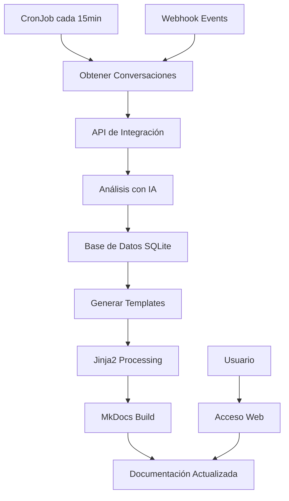

# Sistema de Documentación Automática - MkDocs

## 🎯 **Propósito**

Sistema completo de documentación automática que procesa conversaciones de chat, genera insights con IA y mantiene documentación actualizada en tiempo real usando MkDocs con tema Material.

---

## 📁 **Estructura del Directorio**

```
mkdocs/
├── configs/                        # Configuración de MkDocs
│   ├── mkdocs.yml                  # Configuración principal (tema Material, 12+ plugins)
│   └── processor_config.yaml       # Configuración del procesador
├── templates/                      # Templates Jinja2 (5+ templates)
│   ├── index.md.j2                 # Template principal
│   ├── conversations_summary.md.j2 # Template de conversaciones
│   ├── conversations_by_entity.md.j2 # Conversaciones por entidad
│   ├── catalog_entities.md.j2      # Template de entidades
│   └── quick-start.md.j2           # Guía de inicio rápido
├── processors/                     # Procesador de conversaciones
│   └── conversation_processor.py   # Procesador con análisis IA y SQLite
├── charts/                         # Chart Helm de MkDocs
│   └── mkdocs/
│       ├── Chart.yaml              # Definición del chart
│       ├── values.yaml             # Valores por defecto
│       └── templates/              # Templates de Kubernetes
├── scripts/                        # Scripts de despliegue
│   └── deploy-mkdocs.sh            # Script principal (6 comandos)
├── docs-source/                    # Documentación generada (runtime)
├── Dockerfile                      # Imagen Docker multi-stage
├── requirements.txt                # Dependencias Python
└── README.md                       # Este documento
```

---

## 🚀 **Componentes Principales**

### **1. Procesador de Conversaciones (processors/)**

**Funcionalidad:**
- Análisis automático de conversaciones con IA
- Base de datos SQLite para cache y persistencia
- Generación de insights y patrones automáticos
- Categorización inteligente con tags automáticos
- Procesamiento cada 15 minutos vía CronJob

**Características:**
- **Análisis de Sentimientos**: Detecta tono y contexto
- **Extracción de Entidades**: Identifica componentes mencionados
- **Generación de Resúmenes**: Crea resúmenes automáticos
- **Detección de Patrones**: Identifica preguntas frecuentes
- **Métricas de Uso**: Calcula estadísticas en tiempo real

### **2. Sistema de Templates (templates/)**

**Templates Jinja2 Disponibles:**
- `index.md.j2` - Página principal con resumen general
- `conversations_summary.md.j2` - Resumen de todas las conversaciones
- `conversations_by_entity.md.j2` - Conversaciones agrupadas por entidad
- `catalog_entities.md.j2` - Documentación de entidades del catálogo
- `quick-start.md.j2` - Guía de inicio rápido generada dinámicamente

### **3. Configuración MkDocs (configs/)**

**Plugins Configurados (12+):**
- `material` - Tema Material Design
- `search` - Búsqueda avanzada
- `minify` - Minificación de HTML/CSS/JS
- `git-revision-date-localized` - Fechas de modificación
- `awesome-pages` - Navegación automática
- `macros` - Macros y variables
- `mermaid2` - Diagramas Mermaid
- `table-reader` - Lectura de tablas
- `charts` - Gráficos y visualizaciones
- `social` - Tarjetas sociales
- `tags` - Sistema de etiquetas
- `blog` - Funcionalidad de blog

---

## ⚙️ **Configuración**

### **Variables de Entorno**

```bash
# MkDocs Configuration
MKDOCS_SITE_NAME="Backstage-OpenWebUI Documentation"
MKDOCS_SITE_URL="http://docs.example.com"
MKDOCS_REPO_URL="https://github.com/user/repo"

# Processor Configuration
PROCESSOR_INTERVAL=900  # 15 minutos en segundos
PROCESSOR_DB_PATH="/data/conversations.db"
PROCESSOR_LOG_LEVEL="INFO"

# API Configuration
BACKSTAGE_API_URL="http://backstage:7007/api"
OPENWEBUI_API_URL="http://openwebui:8080/api"
INTEGRATION_API_URL="http://integration-api:8000"

# AI Configuration
OPENAI_API_KEY="your-openai-key"
OPENAI_MODEL="gpt-3.5-turbo"
```

### **Configuración del Procesador (configs/processor_config.yaml)**

```yaml
processor:
  interval: 900  # 15 minutos
  batch_size: 50
  max_retries: 3
  
  database:
    path: "/data/conversations.db"
    backup_interval: 3600  # 1 hora
    
  ai_analysis:
    provider: "openai"
    model: "gpt-3.5-turbo"
    max_tokens: 1000
    temperature: 0.3
    
  templates:
    output_dir: "/docs"
    template_dir: "/templates"
    
  apis:
    backstage:
      url: "${BACKSTAGE_API_URL}"
      timeout: 30
    openwebui:
      url: "${OPENWEBUI_API_URL}"
      timeout: 30
    integration:
      url: "${INTEGRATION_API_URL}"
      timeout: 30
```

---

## 🛠️ **Instalación y Despliegue**

### **1. Desarrollo Local**

```bash
# Instalar dependencias
cd mkdocs/
pip install -r requirements.txt

# Configurar MkDocs
mkdocs serve -f configs/mkdocs.yml

# Ejecutar procesador manualmente
python processors/conversation_processor.py
```

### **2. Despliegue en Kubernetes**

```bash
# Desplegar usando Helm
helm install mkdocs charts/mkdocs/ \
  --namespace default \
  --values charts/mkdocs/values.yaml

# Verificar despliegue
kubectl get pods -l app=mkdocs
kubectl logs -l app=mkdocs -f
```

### **3. Usando Scripts**

```bash
# Script de despliegue completo
./scripts/deploy-mkdocs.sh

# Comandos disponibles:
# - deploy: Desplegar MkDocs
# - build: Construir documentación
# - serve: Servir localmente
# - process: Ejecutar procesador
# - clean: Limpiar archivos generados
# - status: Ver estado del despliegue
```

### **4. Usando Makefile**

```bash
# Desplegar MkDocs
make deploy-mkdocs

# Ver logs
make logs-mkdocs

# Procesar conversaciones manualmente
make process-conversations

# Limpiar documentación
make clean-mkdocs
```

---

## 🔧 **Uso**

### **Procesamiento Automático**

El sistema funciona automáticamente:

1. **CronJob ejecuta cada 15 minutos**
2. **Obtiene conversaciones** de la API de integración
3. **Analiza con IA** para generar insights
4. **Actualiza base de datos** SQLite con resultados
5. **Genera documentación** usando templates Jinja2
6. **Publica automáticamente** en MkDocs

### **Procesamiento Manual**

```bash
# Ejecutar procesador manualmente
kubectl exec -it mkdocs-pod -- python /app/processors/conversation_processor.py

# Procesar conversaciones específicas
kubectl exec -it mkdocs-pod -- python /app/processors/conversation_processor.py --entity-id "component:default/my-service"

# Regenerar toda la documentación
kubectl exec -it mkdocs-pod -- python /app/processors/conversation_processor.py --full-rebuild
```

### **Acceso a la Documentación**

```bash
# URL de acceso (configurar Ingress)
http://docs.your-domain.com

# Port-forward para desarrollo
kubectl port-forward svc/mkdocs 8000:8000
# Acceder en: http://localhost:8000
```

---

## 📊 **Funcionalidades**

### **Análisis Inteligente**

- **Resúmenes Automáticos**: Genera resúmenes de conversaciones largas
- **Extracción de Entidades**: Identifica servicios, componentes y APIs mencionados
- **Análisis de Sentimientos**: Detecta problemas y satisfacción del usuario
- **Patrones de Uso**: Identifica preguntas frecuentes y temas recurrentes
- **Métricas de Adopción**: Calcula estadísticas de uso por entidad

### **Generación Dinámica**

- **Documentación por Entidad**: Crea páginas específicas para cada componente
- **Guías de Troubleshooting**: Genera guías basadas en problemas resueltos
- **FAQs Automáticas**: Crea preguntas frecuentes basadas en conversaciones
- **Métricas Visuales**: Genera gráficos y estadísticas automáticamente

### **Búsqueda Avanzada**

- **Búsqueda Full-text**: Busca en todo el contenido generado
- **Filtros por Entidad**: Filtra por componente o servicio
- **Filtros por Fecha**: Busca conversaciones por período
- **Filtros por Tags**: Busca por categorías automáticas

---

## 📈 **Métricas y Monitoreo**

### **Métricas del Procesador**

```python
# Métricas disponibles en /metrics
- mkdocs_conversations_processed_total
- mkdocs_processing_duration_seconds
- mkdocs_ai_analysis_requests_total
- mkdocs_template_generation_duration_seconds
- mkdocs_database_operations_total
```

### **Health Checks**

```bash
# Verificar salud del procesador
curl http://mkdocs:8000/health

# Respuesta esperada:
{
  "status": "healthy",
  "last_processing": "2025-07-30T22:45:00Z",
  "conversations_count": 150,
  "entities_count": 25,
  "database_size": "2.5MB"
}
```

### **Logs Estructurados**

```bash
# Ver logs del procesador
kubectl logs -l app=mkdocs -f | grep "processor"

# Logs típicos:
{
  "timestamp": "2025-07-30T22:45:00Z",
  "level": "INFO",
  "component": "processor",
  "message": "Processing 15 new conversations",
  "entity_count": 5,
  "duration": 12.5
}
```

---

## 🐛 **Troubleshooting**

### **Problemas Comunes**

1. **Error de Conexión a APIs**
   ```bash
   # Verificar conectividad
   kubectl exec -it mkdocs-pod -- curl http://integration-api:8000/health
   ```

2. **Error de Base de Datos SQLite**
   ```bash
   # Verificar base de datos
   kubectl exec -it mkdocs-pod -- sqlite3 /data/conversations.db ".tables"
   ```

3. **Error de Generación de Templates**
   ```bash
   # Verificar templates
   kubectl exec -it mkdocs-pod -- ls -la /templates/
   ```

4. **Error de Procesamiento IA**
   ```bash
   # Verificar configuración de OpenAI
   kubectl exec -it mkdocs-pod -- env | grep OPENAI
   ```

### **Comandos de Diagnóstico**

```bash
# Estado completo del sistema
make mkdocs-status

# Logs detallados
kubectl logs -l app=mkdocs --tail=100

# Verificar CronJob
kubectl get cronjobs
kubectl describe cronjob mkdocs-processor

# Verificar volúmenes
kubectl get pvc -l app=mkdocs
```

---

## 🔄 **Flujo de Procesamiento**



---

## 📚 **Ejemplos de Documentación Generada**

### **Página Principal (index.md)**
- Resumen general del sistema
- Estadísticas de uso
- Últimas conversaciones
- Enlaces rápidos

### **Conversaciones por Entidad**
- Historial completo por componente
- Resúmenes automáticos
- Problemas resueltos
- Métricas de uso

### **FAQ Automática**
- Preguntas más frecuentes
- Respuestas basadas en conversaciones reales
- Enlaces a conversaciones relacionadas

---

## 🎯 **Estado del Componente**

- ✅ **Procesador IA**: Análisis automático implementado y funcional
- ✅ **Templates Jinja2**: 5+ templates dinámicos funcionando
- ✅ **MkDocs**: Configuración completa con 12+ plugins
- ✅ **Base de Datos**: SQLite con cache y persistencia
- ✅ **CronJob**: Procesamiento automático cada 15 minutos
- ✅ **Chart Helm**: Despliegue automatizado en Kubernetes
- ✅ **Monitoreo**: Health checks y métricas configurados
- ✅ **Documentación**: Sistema completamente documentado

**¡Sistema de documentación automática completamente funcional!** 📚✨
